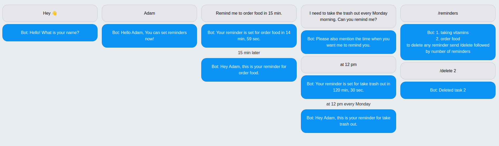

# Chatbot Application - Getting Started Guide



This guide provides step-by-step instructions on how to start the chatbot application and configure it for testing. Follow the steps below to set up and run the application.

## Prerequisites

Before starting the application, ensure that you have the following requirements met:

- Python installed on your system.
- Twilio account credentials (Account SID, Auth Token).
- ngrok application installed on your system.

## 1. Starting the Application

Follow the steps below to start the chatbot application:

1. Open PowerShell as an administrator.
2. Change the directory to the folder where `myenv` is saved:
   ```
   cd <path-to-folder>
   ```
3. Activate the virtual environment:
   ```
   myenv\Scripts\activate
   ```
4. Navigate to the current version of the chatbot folder:
5. Update the Twilio account authentication details in the `.env` file. Make sure to provide the correct Account SID, Auth Token, and phone number.
6. Start the Flask application:
   ```
   flask run
   ```

## 2. Starting the ngrok Application

Follow the steps below to start the ngrok application:

1. Open the ngrok folder and locate the ngrok application.
2. Open the ngrok application, which will launch a new PowerShell window specifically for ngrok.
3. In the ngrok PowerShell window, run the following command:
   ```
   ngrok http 5000
   ```
4. After running the command, you will see two URLs generated by ngrok:
   - `http://127.0.0.1:4040`
   - `https://<numbers>.ngrok-free.app`
5. Open both URLs in your preferred web browser to ensure they are working correctly.
6. Open your Twilio account and navigate to the following URL to access the Twilio number configuration: `https://console.twilio.com/us1/develop/phone-numbers/manage/incoming`
7. Scroll down to the "Messaging Configuration" section and locate the two "URL" fields.
8. Enter the `https://<numbers>.ngrok-free.app` URL with `/sms` at the end in the top field and save the configurations.
9. Your chatbot is now ready to be tested!

You can now interact with the chatbot by sending SMS messages to the configured Twilio number. The ngrok application allows the chatbot to receive incoming messages from external sources.

Please note that these instructions provide a general guide to starting the chatbot application. Make sure to adjust the paths and commands according to your specific environment setup.

- Adding Geo permissions to send sms to that area 
  https://console.twilio.com/?frameUrl=/console/sms/settings/geo-permissions
